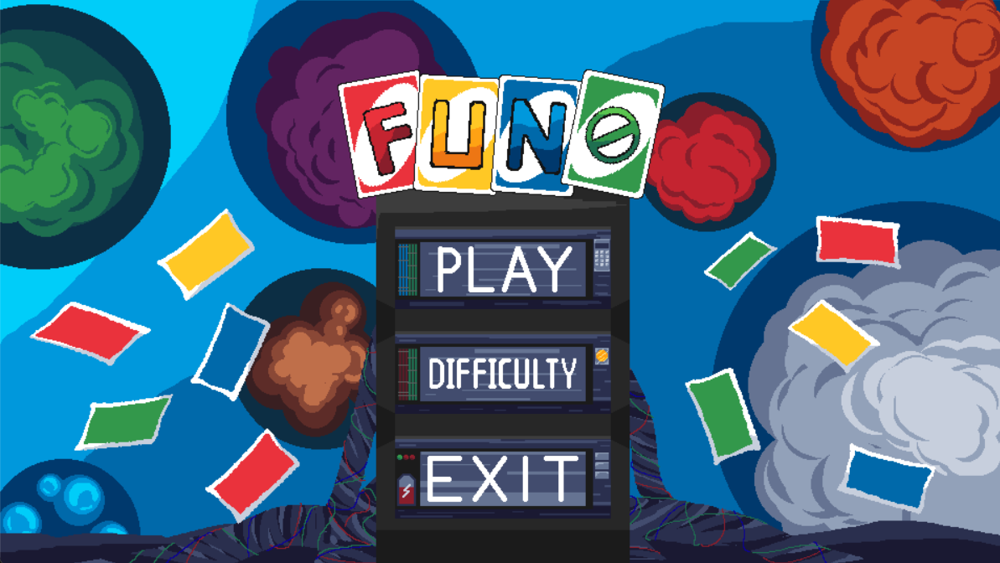
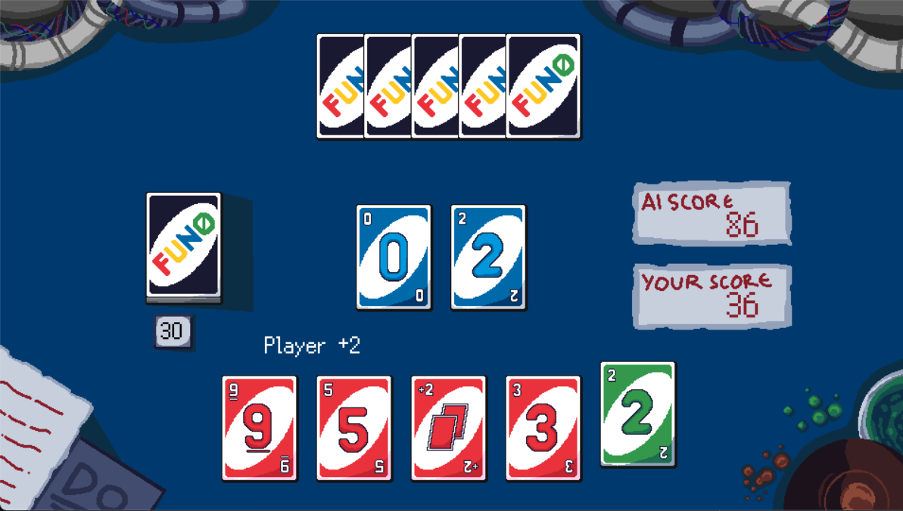
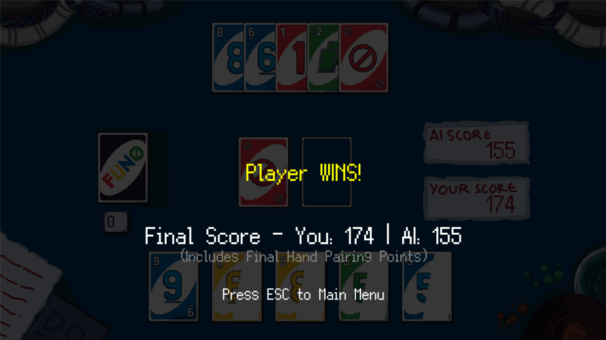

# 🃏 FUNO - Fast & Furious UNO

> *Real-Time Strategy Card Game Driven by Chaos & Adrenaline*


---

## 📑 Daftar Isi

- [Tentang Proyek](#-tentang-proyek)
- [Struktur Repositori](#-struktur-repositori)
- [Fitur & Mekanisme Game](#-fitur--mekanisme-game)
- [Implementasi OOP](#-implementasi-oop-pbo)
- [Instalasi & Cara Main](#-instalasi--cara-main)
- [Galeri Gameplay](#-galeri-gameplay)
- [Kontribusi & Credits](#-kontribusi--credits)

---

## 🎯 Tentang Proyek

**FUNO** adalah reinterpretasi modern dari permainan kartu klasik UNO yang dikembangkan menggunakan **Python** dan **Pygame**. Berbeda dengan UNO konvensional yang berbasis giliran (*turn-based*), FUNO mengusung konsep **Real-Time Battle**.

Proyek ini dibuat untuk memenuhi tugas akhir mata kuliah **Pemrograman Berorientasi Objek (PBO)**, mendemonstrasikan penerapan prinsip-prinsip arsitektur perangkat lunak yang solid seperti Encapsulation, Inheritance, Polymorphism, dan Composition dalam pengembangan game.

### 🌟 Fitur Utama

- **⚡ Real-Time Gameplay**: Tidak ada giliran! Siapa cepat dia dapat. Adu kecepatan reaksi melawan AI.
- **🧠 Adaptive AI**: 3 Tingkat kesulitan (*Baby, Kid, Man*) dengan simulasi waktu reaksi manusia.
- **✨ Visual Juice**: Efek *shimmering* pada kartu pair, partikel confetti, dan *screen shake* saat kartu spesial turun.
- **📈 Dynamic Scoring**: Kartu +2 dan +4 bukan menambah kartu, tapi mengalikan skor!
- **🔊 Immersive Audio**: SFX responsif untuk setiap aksi kartu.

---

## 📂 Struktur Repositori

Struktur direktori dirancang secara modular memisahkan *Core Logic*, *UI/Screen*, dan *Assets*.

```text
FUNO-PBO-FP/
├── assets/                    # Gambar, Font, dan Audio
├── src/                       # Source Code Utama
│   ├── core/                  # Backend Logic (Game Rules)
│   │   ├── __init__.py
│   │   ├── card.py            # Representasi Kartu
│   │   ├── deck.py            # Manajemen Tumpukan Kartu
│   │   ├── effect_manager.py  # Logika Efek Kartu (Polymorphism)
│   │   ├── game_manager.py    # Controller Utama (Composition)
│   │   ├── npc.py             # AI Logic (Inheritance)
│   │   └── player.py          # Base Player Class
│   │
│   ├── screen/                # Frontend Logic (Visual)
│   │   ├── __init__.py
│   │   ├── base.py            # Abstract Base Screen
│   │   ├── game_screen.py     # Layar Permainan Utama
│   │   └── main_menu.py       # Menu & Difficulty Selection
│   │
│   ├── ui/                    # Reusable UI Components
│   │   ├── __init__.py
│   │   ├── components.py      # Buttons & Widgets
│   │   └── deck_animation.py  # Animasi Tumpukan Deck
│   │
│   ├── utils/                 # Utilities
│   │   ├── __init__.py
│   │   └── constants.py       # Global Config & Settings
│   │
│   ├── __init__.py
│   ├── main.py                # Entry Point Aplikasi
│   └── screen_manager.py      # State Machine Manager
│
└── README.md                  # Dokumentasi Proyek
---

## 🎮 Fitur & Mekanisme Game

### Aturan Main (The FUNO Way)
1.  **Speed Battle**: Pemain dan AI berlomba menurunkan kartu yang cocok (Warna/Angka) dengan Main Card di tengah.
2.  **Special Effects**:
    * `Skip`: Membekukan lawan (Freeze) selama beberapa detik.
    * `Reverse`: Menukar satu kartu acak dari tangan lawan.
    * `Wild`: Mengganti warna Main Card.
3.  **Scoring Multiplier**:
    * Kartu `+2` mengalikan skor Main Card sebesar 2x.
    * Kartu `+4` mengalikan skor Main Card sebesar 4x.
4.  **Final Pairing**: Saat deck habis, sisa kartu di tangan akan diadu (Pairing) untuk bonus poin terakhir.

---

## 🧩 Implementasi OOP (PBO)

Proyek ini menerapkan 6 pilar utama Pemrograman Berorientasi Objek:

| Konsep | Implementasi dalam FUNO |
| :--- | :--- |
| **1. Class & Object** | Blueprint `Card` digunakan untuk membuat objek kartu Merah 9, Biru 5, dll. |
| **2. Encapsulation** | Variabel skor dan kartu di tangan (`__hand`) bersifat *private* di class `Player`, diakses via `@property`. |
| **3. Inheritance** | `AIPlayer` mewarisi sifat `Player` namun menambahkan logika otak buatan sendiri. |
| **4. Polymorphism** | Method `apply_effect()` di `EffectManager` memiliki perilaku berbeda tergantung jenis kartu (Skip/Reverse). |
| **5. Abstraction** | `BaseScreen` adalah kerangka abstrak untuk `MainMenu` dan `GameScreen`. |
| **6. Composition** | `GameManager` **memiliki** (`has-a`) objek `Deck` dan `Player` di dalamnya untuk menjalankan game. |

---

## 🛠️ Instalasi & Cara Main

### Prerequisites

- Python 3.8 atau lebih baru.
- Library `pygame` atau `pygame-ce`.

### Langkah Instalasi

1.  **Clone Repositori**
    ```bash
    git clone [https://github.com/username/FUNO-PBO-FP.git](https://github.com/username/FUNO-PBO-FP.git)
    cd FUNO-PBO-FP
    ```

2.  **Install Dependencies**
    ```bash
    pip install pygame
    ```

3.  **Jalankan Game**
    Pastikan Anda berada di root folder `FUNO-PBO-FP/`, lalu jalankan:
    ```bash
    python -m src.main
    ```
    *Atau:*
    ```bash
    python src/main.py
    ```

---

## 📸 Galeri Gameplay

| Main Menu & Difficulty | Gameplay Action | Game Over & Scoring |
| :---: | :---: | :---: |
|  |  |  |
| *Pilihan tingkat kesulitan adaptif* | *Visual effect shimmering & particles* | *Sistem skor detail & pairing bonus* |

---

## 🤝 Kontribusi & Credits

### 👥 Tim Pengembang
Proyek ini dikembangkan secara kolaboratif untuk Tugas Akhir PBO.

- **Muhammad Aditya Nugraha**
  - *Role*: **Lead Programmer & Game Designer**
  - *Responsibility*: Merancang arsitektur OOP, logika inti permainan (Game Loop), sistem AI cerdas, dan mekanisme *gameplay*.

- **Royan Harits Yustanto**
  - *Role*: **UI/UX Designer & Visual Artist**
  - *Responsibility*: Merancang antarmuka pengguna (User Interface), membuat aset visual *Pixel Art*, dan memastikan pengalaman pengguna (UX) yang responsif.

### Aset & Referensi
- **Font**: Pix32 (Pixel Art Font)
- **Audio**: OpenGameArt & Itch.io Assets
- **Images**: Custom Pixel Art Assets

---

<div align="center">

**⭐ Star repositori ini jika Anda menyukai konsepnya! ⭐**

*Keep Coding & Play FUNO!*

</div>
